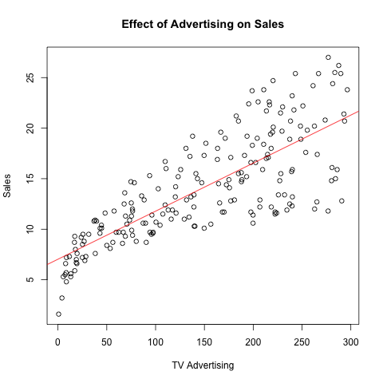
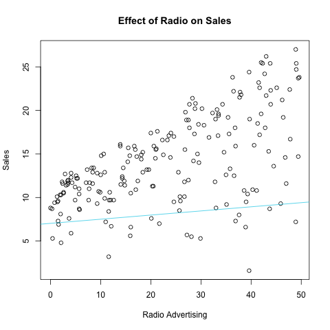
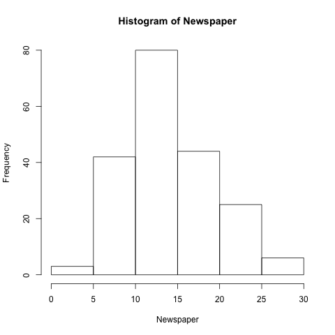
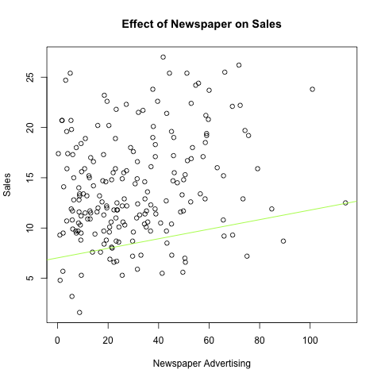
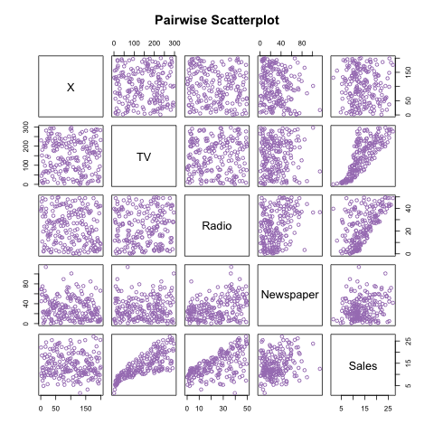

## Abstract

Working with reproducability in mind, this report generates the results given in Chapter 3.2 of "An Introduction to Statistical Learning." I reproduce the tables given in this chapter, using the data set the authors used. It can be downloaded at: http://www-bcf.usc.edu/~gareth/ISL/Advertising.csv. A multiple linear regression is run to see if are results match the original results. 

## Introduction

Advertising can be extremely costly, but also extremely effective. The goal is to spend as little on advertising as possible while seeing the most payoff as an increase in sales. By running a multiple linear regression, we can estimate the effect advertising via television, radio, and newspapers has on sales and therefore extrapolate that to how worthwhile a method of advertising is. If we know the expected increase of sales for every increase of TV, radio, or newspaper advertising, we can then calculate how much money we are spending on advertising verus how much money we make from the addionional sales and see if the method of avertising is profitable. If it's profitable, we can increase expenditure in that avenue to increase sales but we also might see expenditures in different areas of advertisment bring even more sales and more returns. The scope of this report focuses on these three methods of advertising and the effect they have on sales but it is important to understand the broad application a regression such as this one can have in a business setting. 

## Data

The data used for this report is advertising data of a product that includes the sales (measured in thousands of units) of a product across two hundred different markets and the amount spent on advertising (measured in thousands of dollars). The advertising data is colleced in three different avenues of advertising: television, radio, and newspaper. Each entry in the data set has the corresponding amount spent on the different advertising media and the corresponding amount of sales of the product in that time period. 

## Methodology

The effect of one method of advertising on sales could be determined by a simple linear regression of that one method on sales. For this example, we will use TV advertising as the method we choose to do a simple linear regression. This follows the model:

### Simple Linear Regression : Y = B0 + X1B1 + u

##### Y : Total Sales

This is the dependent variable in our model and is effected by the amount of money spent on TV advertising. We calculate this predicted value based on the other elements of the model.

##### B0 : Intercept

The intercept is the amount of sales of the produce we would see even with no money spent on television advertising. Of course, it is natural to assume that we would sell some amount of product without any advertising at all.

##### B1 : Coefficient on TV advertising

The coefficient on TV advertising represents the amount we predict to see total sales increase if we increase the amount spent on TV advertising by one unit. This follows from assuming advertising has an effect on sales and calculating what that effect is from the data set. 

##### u : error

The error term is random noise and something for which we cannot control. This incorporates the idea that while we predict sales will be one thing, it might not hit that exact target due to random chance. 

In contrast, we can analyze the effect of advertising by television, radio, or newspaper both individually and in unison with each other on the amount of sales, with a multiple linear regression. This method holds the amount of advertising on radio and newspapers constant and only varies the amount of advertising spent on television, then measures the change in sales corresponding to a one unit change in the amount of money spent on telvision advertisment. This gives us an estimate of the effect television advertising has on total sales. This method is then repeated for both radio advertising and newspaper advertising, and the coefficients for each are produced. The model for this regression is as follows:

### Multiple Linear Regression : Y = B0 + X1B1  + X2B2 + X3B3 + u

##### Y : Total Sales

This is the dependent variable in our model and represents the same thing as in the simple linear regression.

##### B0 : Intercept

The intercept is the amount of sales of the produce we would see even with no money spent on television advertising and also represents the same thing as in the smiple linear regression. This number can change in the multiple linear regression, as effects that may have been absorbed by the intercept are now realized to be because of a change in radio or newspaper advertising.

##### B1 : Coefficient on TV advertising

The coefficient on TV advertising represents the amount we predict to see total sales increase if we increase the amount spent on TV advertising by one unit. This number can also change in a multiple linear regression because of the relationship of TV advertising with newspaper and radio advertising. 

#### B2 : Coefficient on Radio, B3: Coefficient on Newspaper

These coefficients have the same interpretation as the coefficient for TV advertising (B1), but they are dependent on radio advertising and newspaper advertising, respectively.

##### X1 : TV advertising amount 

This is the independent variable in the model. Given the chosen amount of TV advertising, we can calculate the expected value of total sales. 

#### X2 : Radio advertising amount, X3 : Newspaper advertising amount

These variables have the same interpretation as the variable for TV advertising (X1), but they are dependent on radio advertising amount and newspaper advertising amount, respectively. 

## Results

```{r, echo = FALSE}
ad <- read.csv("../data/Advertising.csv")
load(file = "../data/regression.RData")
```

Results from the three separate linear regressions are as follows:

#### Simple Linear Regression of TV and Sales

Parameter | Estimate | Standard Error | T-stat | p-value
----------|---------|--------|-------|
Intercept | `r sumtv$coefficients[1,1]` | `r sumtv$coefficients[1,2]` | `r sumtv$coefficients[1,3]` | `r sumtv$coefficients[1,4]`
TV advertising | `r sumtv$coefficients[2,1]` | `r sumtv$coefficients[2,2]` | `r sumtv$coefficients[2,3]` | `r sumtv$coefficients[2,4]`

Since the p-value of this test comes back extremely small, we can conclude that TV advertising probably has an effect of sales, which is about `r sumtv$coefficients[2,1]`, with a standard error of `r sumtv$coefficients[2,2]`.




We can see the visual realization of the regression in this plot. There is a positive correlation between TV advertising and sales, hence the positive slope of the graph. The best fit line (in red) shows us our prediction of where total sales should be given TV advertising, based on our estimate of the coefficient from the data. The slope of this line is equal to the coefficient and is equal to `r sumtv$coefficients[2]`. If all the dots were perfectly on the line, this would mean every outcome matched every prediction the model made, and there would be no random chance. Where deviations from the line occur, we explain this as random error that we cannot control. 

Running the same test for the other two method of advertising, we get these results: 

#### Simple Linear Regression of Radio and Sales

Parameter | Estimate | Standard Error | T-stat | p-value
----------|---------|--------|-------|
Intercept | `r sumradio$coefficients[1,1]` | `r sumradio$coefficients[1,2]` | `r sumradio$coefficients[1,3]` | `r sumradio$coefficients[1,4]`
TV advertising | `r sumradio$coefficients[2,1]` | `r sumradio$coefficients[2,2]` | `r sumradio$coefficients[2,3]` | `r sumradio$coefficients[2,4]`




#### Simple Linear Regression of Newspaper and Sales

Parameter | Estimate | Standard Error | T-stat | p-value
----------|---------|--------|-------|
Intercept | `r sumnews$coefficients[1,1]` | `r sumnews$coefficients[1,2]` | `r sumnews$coefficients[1,3]` | `r sumnews$coefficients[1,4]`
TV advertising | `r sumnews$coefficients[2,1]` | `r sumnews$coefficients[2,2]` | `r sumnews$coefficients[2,3]` | `r sumnews$coefficients[2,4]`




### Multiple Linear Regression Results:

Parameter | Estimate | Standard Error | T-Stat | pvalue
----------|----------|----------|---------|
Coefficient on TV | `r sumreg$coefficients[2,1]` | `r sumreg$coefficients[2,2]` | `r sumreg$coefficients[2,3]` | `r sumreg$coefficients[2,4]`
Coefficient on Radio | `r sumreg$coefficients[3,1]` | `r sumreg$coefficients[3,2]` | `r sumreg$coefficients[3,3]` | `r sumreg$coefficients[3,4]`
Coefficient on Newspaper | `r sumreg$coefficients[4,1]` | `r sumreg$coefficients[4,2]` | `r sumreg$coefficients[4,3]` | `r sumreg$coefficients[4,4]`
Intercept | `r sumreg$coefficients[1,1]` | `r sumreg$coefficients[1,2]` | `r sumreg$coefficients[1,3]` | `r sumreg$coefficients[1,4]`

We can see that the effect of each method of advertising changed a bit in the multiple linear regression. This is likely due to the correlation between each method of advertising and each method with sales. We can see this correlation matrix below:

```{r, echo = FALSE}
a <- cor(ad)
```

 | TV | Radio | Newspaper | Sales
 ---|---|---|----|
 TV | `r a[2,2]` | `r a[2,3]` | `r a[2,4]` | `r a[2,5]`
Radio | | `r a[3,3]` | `r a[3,4]` | `r a[3,5]`
Newspaper | | | `r a[4,4]` | `r a[4,5]`
Sales | | | | `r a[5,5]`



This least squares model has values for RSS, TSS and RSE that let us calculate an F-statistic to find the likelihood of getting this result given the advertising methods have no effect on sales. If this liklihood is extremely low, we can conclude that the method of advertising probably did effect sales. 

Quantity | Value
-----|------
Residual Squared Error | `r sumreg$sigma`
Adjusted R-Squared | `r sumreg$r.squared`
F-Statistic | `r sumreg$fstatistic`

The R-squared value tells us how much of the chance in Y is explained by the change in X. Here our R-squared value is about `r sumreg$r.squared` which means that around `r sumreg$r.squared * 100`% of the change in total sales is due to the change in expenditure in TV advertising. This is a strong R-squared value and we can conclude that the data is explained well by our model. 

## Conclusions

The main conclusion we draw from this analysis is for every 1,000 dollar increase in TV, radio, or newspaper advertising, there is an increase corresponding to the coefficient on the variable from the model for the method of advertising in total sales. It is up to the individual business to interpret this as profitable or worthwhile, as they can calculate how much revenue is made from selling x amount of products and see if that is justified by spending $1,000 on television advertising. The results are the same as presented in chapter 3.1 of An Introduction to Statistical Learning, which is further evidence that our regression and the original regression was run correctly. This is important because if businesses are planning on using this model to estimate cost and returns, they stand to lose money if the results are incorrect. Of course as with any statistical estimation, there is always a standard error and deviation so our results are most likely not completely accurate but as long as their close enough and provide those potential deviations, businesses can adjust and plan accordingly. 
